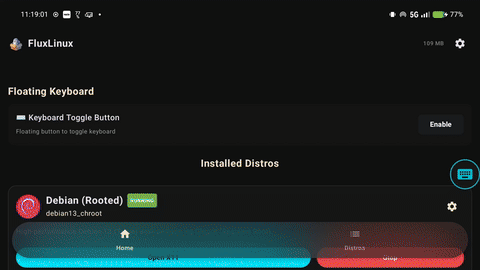
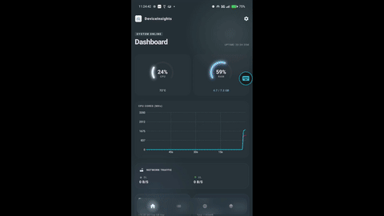
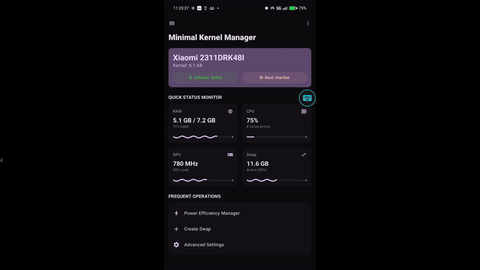
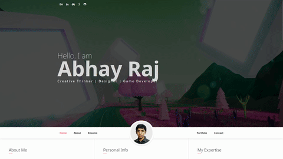

# Hi, I'm @abhay-byte  

  
  
  

## 👨‍💻 About Me

Open source enthusiast and **FOSS developer**, Passionate about community-driven development and making software accessible for everyone. Reach me through - 

- 📬 **Email:** [`abhay.byte02@gmail.com`](mailto:abhay.byte02@gmail.com) — best way to reach me!!!
- 💼 **LinkedIn:** [Abhay Raj](https://www.linkedin.com/in/abhay-byte/) — let's network!!!

## 📄 Resume

Check out my latest resume with all my experience, skills, and achievements!

## My Projects

| Icon | Project | Description | Screenshot | Links |
|:----:|---------|-------------|:----------:|-------|
|  | **Fantasy Racing** | High-speed futuristic racing game with diverse planets, strategic challenges, and immersive gameplay |  |   |
|  | **Story of Xirsia** | 2D Role Playing Game set in Medieval age with massive 25km² open world of Xirsia Isle to explore |  |    |
|  | **FluxLinux** | Run full Linux desktop environments on Android with GPU acceleration and dev stacks |  |    |
|  | **FinalBenchmark 2** | Comprehensive CPU benchmarking app with 10+ tests and thermal management |  |    |
|  | **DeviceInsight** | Premium system monitoring with glassmorphism UI and real-time analytics |  |   |

|  | **MKM** | Minimal Kernel Manager for persistent swap management with Shizuku support |  |   |
|  | **Clinico** | AI-powered healthcare platform with 24/7 AI companion, telehealth, and hyperlocal clinic discovery |  |       |
|  | **My Portfolio** | Personal portfolio website showcasing projects, skills, and experience with responsive design |  |    |
|  | **WebGL Website** | Interactive website built with WebGL for stunning 3D graphics and animations |  |    |
| 📊 | **Investment Growth Prediction** | AI-powered investment growth predictor with monthly contribution simulations, CSV reports, and graphical insights for informed financial decisions |  |    |
| 👻 | **Whispers in the Mist** | Horror game set in St. Xavier's Boarding School in Ooty during Valentine's Day with mysterious occurrences |  |   |
| ✨ | **ThreeJS Portfolio** | Interactive 3D portfolio website built with Three.js |  |  |
|  | **Clinico Frontend** | Professional & Admin portal with doctor dashboard, patient management, and NGO partner interface |  |    |

## 🏆 GitHub Stats

