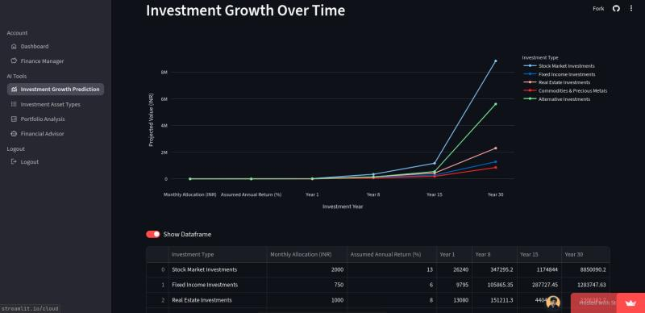
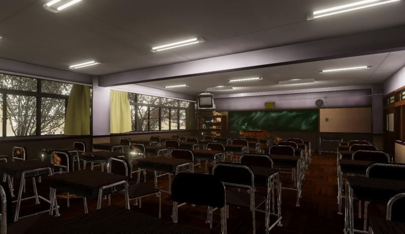
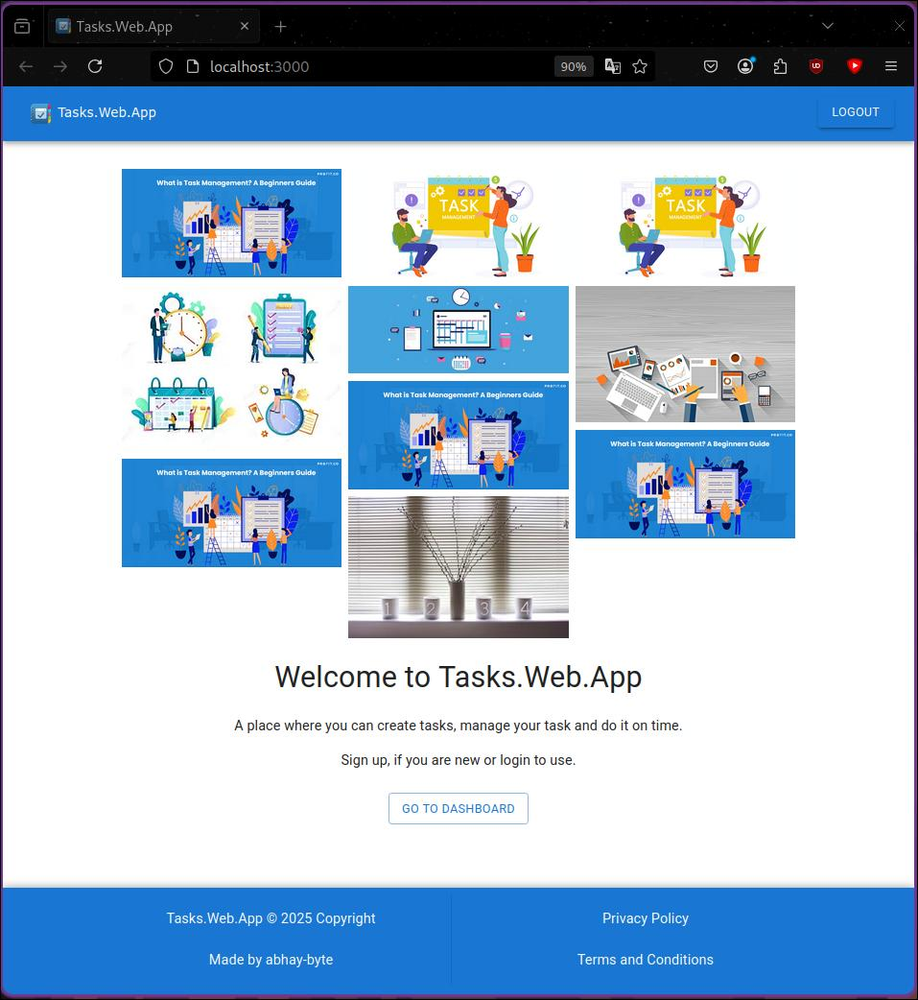
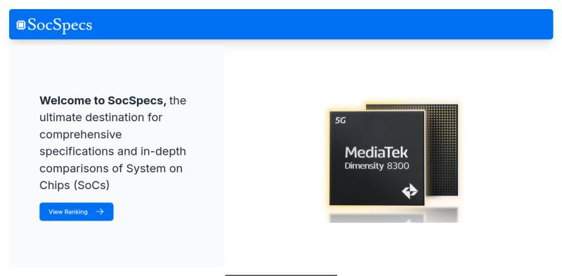
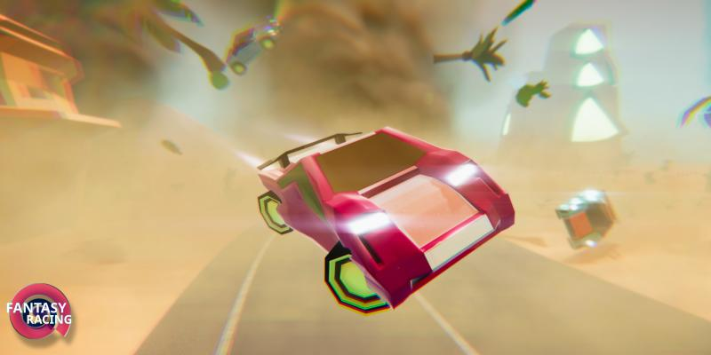

# Hi, I'm @abhay-byte  

  
  
  <a href="https://github.com/abhay-byte?tab=repositories">
    

- 👀 I'm interested in Mobile Develeopment, Web Development, Game Development, Metaverse and AI.

- 🌱 I'm currently diving deeper into Next.js, MERN Stack, Game Developement and GenAI.
  
- 💞️ I'm excited to collaborate on open-source projects, indie game developments. If you're building something cool, let's talk!

- 📫 You can best reach me via email at `abhay.byte02@gmail.com`, connect with me on [LinkedIn](https://www.linkedin.com/in/abhay-byte/), or check out my projects on my [Portfolio](https://abhayraj-porfolio.web.app/).
   * Also find me on [Behance](https://www.behance.net/abhay-raj) and my [Google Developer Profile](https://play.google.com/store/apps/dev?id=8004929841101888920&hl=en_US&gl=US&pli=1)

- 😄 Pronouns: He/Him

- ⚡ Fun fact: I love tinkering with tech, especially exploring how far we can push hardware. Running Linux on Android or benchmarking.

Feel free to connect, collaborate, and share the passion for building amazing things with code, whether it's for the web or a game engine! Let's learn and grow together. 🚀

## 🏆 GitHub Trophies

## 🛠️ My Tech Toolbox

### 🚀 Core Highlights

💻 Programming Languages

  
 

| Category             | Technologies                                                      |
| -------------------- | ----------------------------------------------------------------- |
| **Core Languages**   |  |
| **Markup & Styling** |              |

🌐 Web Development

  
 

| Category                | Technologies                                                               |
| ----------------------- | -------------------------------------------------------------------------- |
| **Frontend Frameworks** |                   |
| **CSS Frameworks & UI** |         |
| **Backend / API**       |                 |
| **Databases**           |  |

☁️ Cloud, Hosting & DevOps

  
 

| Category             | Technologies                                                 |
| -------------------- | ------------------------------------------------------------ |
| **Cloud Providers**  |    |
| **Hosting & BaaS**   |  |
| **Containerization** |           |
| **Version Control**  |              |

🔬 Specialized Fields

  
 

| Category                 | Technologies                                                                |
| ------------------------ | --------------------------------------------------------------------------- |
| **Data Science & AI**    |  |
| **Game Engines**         |              |
| **Design & 3D Modeling** |                   |

🧰 Tools & Software

 

| Category              | Technologies                                                                                 |
| --------------------- | -------------------------------------------------------------------------------------------- |
| **IDEs & Editors**    |  |
| **API & Automation**  |                                 |
| **Operating Systems** |                 |

<!-- PROJECTS SECTION START -->
## 🛠️✨ Projects

Expand Section

 

### [Investment Growth Prediction](https://github.com/abhay-byte/AI_WRAPPER_PROJECTS) ([Live Demo](https://aiwrapper.streamlit.app)) (WIP)
*Apr 2025 - Present*  `
**Tech:** Python (Streamlit, Pandas, Numpy, Plotly, GenAI)  
- AI-powered tool to predict investment growth over time.
- Users input monthly contributions to simulate outcomes for various asset types.
- Generates CSV reports and graphical insights for informed decisions.
- **Skills:** pandas, NumPy, Streamlit, GenAI, Full-Stack Development, Google Gemini  

<!-- Replace above with your actual image URL if hosted, or use the following local path if in repo: -->
<!--  -->

---

### [Final Benchmark 2025](https://gitlab.com/abhayraj/final-benchmark-2025) (WIP)
*Jun 2024 - Present*  
**Tech:** Unity, C#  
- Open source Android benchmark app for CPU, GPU, RAM, Storage.
- **Skills:** Unity, C#, Full-Stack Development  

---

### [Task.Web.App](https://github.com/abhay-byte/task_management_tool) (WIP)
*Mar 2025 - Apr 2025*  
**Tech:** MERN (React.js, Express.js, MongoDB, Node.js), MUI, GCP  
- Task management web app for organizing and tracking daily tasks.
- User authentication, authorization, and statistics visualization.
- **Skills:** React.js, Node.js, MongoDB, Express.js, Material-UI, GCP, Full-Stack Development  

---

### [SocSpecs](https://github.com/abhay-byte/fb_nextjs) (WIP)
*Sep 2024 - Nov 2024*  
**Tech:** Next.js, PostgreSQL, TailwindCSS, Vercel, AWS  
- Platform for smartphone SoC specs, comparisons, and benchmarks.
- **Skills:** AWS, PostgreSQL, Web Development, Tailwind CSS, Next.js, Full-Stack Development  

---

### [Fantasy Racing - Star Alliance](https://play.google.com/store/apps/details?id=com.ivarnagames.fantasyracer&hl=en_US&gl=US) (WIP)
*Game Project*  
**Tech:** Unity, C#, Blender  
- Sci-fi racing game with planetary environments, power-ups, upgrades, and multiplayer features.
- Compete, earn reputation, unlock achievements, and join guilds.
- **Skills:** Unity, Game Programming, C#, Blender, Game Design, Game Development, Full-Stack Development  

<!-- PROJECTS SECTION END -->

## 📊 GitHub Stats

## 📅 GitHub Contribution Calendar

<!-- GitHub contribution calendar image -->

<!-- WakaTime Stats -->
## ⏱️ Dedicated to Time Statistics (via WakaTime)
  

  

<!--START_SECTION:waka-->
<!--WakaTime stats will be inserted here automatically by GitHub Action if enabled-->
<!--END_SECTION:waka-->

<h2 align="left" style="color:#FFA500;">🤜🤛 Friends Section</h2>

  

<table>
  <tr>
    <td align="center">
      <a href="https://github.com/alokranjan07" style="color:#FFD700;">
        
         
        Alok Ranjan
      </a>
    </td>
    <td align="center">
      <a href="https://github.com/bhumika1534" style="color:#FFD700;">
        
         
        Bhumika Choudhary
      </a>
    </td>
    <td align="center">
      <a href="https://github.com/brownpanthera" style="color:#FFD700;">
        
         
        Ali Faizan
      </a>
    </td>
    <td align="center">
      <a href="https://github.com/JICA98" style="color:#FFD700;">
        
         
        JICA98
      </a>
    </td>
    <td align="center">
      <a href="https://github.com/mayank30092" style="color:#FFD700;">
        
         
        Mayank Mittal
      </a>
    </td>
  </tr>
  <tr>
    <td align="center">
      <a href="https://github.com/PriyanshuGupta1102" style="color:#FFD700;">
        
         
        Priyanshu Gupta
      </a>
    </td>
    <td align="center">
      <a href="https://github.com/screechingghost" style="color:#FFD700;">
        
         
        Roshan Alex
      </a>
    </td>
    <td align="center">
      <a href="https://github.com/Shashankshekharjha7" style="color:#FFD700;">
        
         
        Shashank Shekhar
      </a>
    </td>
    <td align="center">
      <a href="https://github.com/spakigamer" style="color:#FFD700;">
        
         
        Dhruv Goel
      </a>
    </td>
  </tr>
</table>

## 🤝 Let's Connect!

Hey there! I'm always excited to connect, collaborate, or just chat about tech, design, or anything creative. Feel free to reach out — I’d love to hear from you!

- 📬 **Email:** [`abhay.byte02@gmail.com`](mailto:abhay.byte02@gmail.com) — best way to reach me!
- 💼 **LinkedIn:** [Abhay Raj](https://www.linkedin.com/in/abhay-byte/) — let's network!
- 🌐 **Portfolio:** [abhayraj-porfolio.web.app](https://abhayraj-porfolio.web.app/) — check out my latest work.
- 🎨 **Behance:** [@abhay-raj](https://www.behance.net/abhay-raj) — where I share design stuff.
- 👨‍💻 **Google Developer Profile:** [My Play Store Projects](https://play.google.com/store/apps/dev?id=8004929841101888920&hl=en_US&gl=US&pli=1)
- 📸 **Instagram:** [@abhayrajx](https://www.instagram.com/abhayrajx/) — for behind-the-scenes, life, and passion projects.
- 🐦 **Twitter (X):** [@arch_deve](https://x.com/arch_deve) — tweets, updates, and thoughts.

## ☕ Have a Cup of Coffee & Chillll.....

Thanks for scrolling this far — you’re awesome!
Whether you're here to connect, collaborate, or just explore, take a breath, sip something warm,
and enjoy the journey. Let's build cool stuff together. 🚀

✨ Something More About Me

 

## 🌱 My Hobbies

• Gardening 🪴🌿  
• Helping Others 🤝  
• Linux Power User 🐧 _(I use Arch Linux btw )_ 😂  
• Tech Enthusiast 💻🛠️  
• Anime Lover 🎌 _(One Piece)_  
• Manhwa Reader 📖 _(Overgeared)_  
• Light Novel Reader 📚 _(Legendary Moonlight Sculptor)_  
• Workout (Gym) 🏋️  
• Track & Field 🏃‍♂️  
• Badminton 🏸

