# Hi, I'm @abhay-byte — Agentic Software Engineer  

  
  
  

## 🚀 About Me
Agentic software engineer. I build with **opencode and codex**, orchestrated through [Nexus Terminal](https://github.com/abhay-byte/nexus) — my AI harness. Every project here is **FOSS**: code, assets, zero paywalls.

  

## 📚 My Knowledge Base

Structured notes on software engineering, system design, AI tooling, and personal projects — designed to be useful for both humans and AI agents.

> **Note:** Many things are automated, synced, and constantly updated with new info.

 

## My Projects

<table>
<thead>
<tr>
<th align="left" width="50%">Project</th>
<th align="center" width="50%">Showcase</th>
</tr>
</thead>
<tbody>
<tr>
<td width="50%" valign="top" style="padding:18px 12px;border-bottom:1px solid #3c3836;">
<h3> <a href="https://github.com/abhay-byte/fluxlinux"><b>FluxLinux</b></a></h3>
Run full Linux desktop environments on Android with GPU acceleration and dev stacks.  
    
</td>
<td width="50%" align="center" valign="middle" style="padding:18px 12px;border-bottom:1px solid #3c3836;">

</td>
</tr>
<tr>
<td width="50%" valign="top" style="padding:18px 12px;border-bottom:1px solid #3c3836;">
<h3>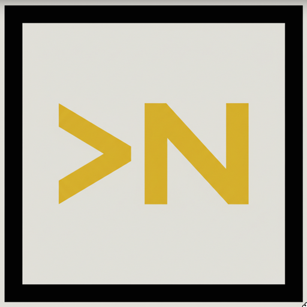 <a href="https://github.com/abhay-byte/nexus"><b>Nexus Terminal</b></a></h3>
Multi-agent AI terminal workspace. Run Claude Code, Codex CLI, Gemini CLI, Qwen, Aider, and more — side-by-side in a brutalist desktop app.  
  
</td>
<td width="50%" align="center" valign="middle" style="padding:18px 12px;border-bottom:1px solid #3c3836;">

</td>
</tr>
<tr>
<td width="50%" valign="top" style="padding:18px 12px;border-bottom:1px solid #3c3836;">
<h3> <a href="https://github.com/abhay-byte/finalbenchmark-platform"><b>FinalBenchmark 2</b></a></h3>
Comprehensive CPU benchmarking app with 10+ tests and thermal management.  
   
</td>
<td width="50%" align="center" valign="middle" style="padding:18px 12px;border-bottom:1px solid #3c3836;">

</td>
</tr>
<tr>
<td width="50%" valign="top" style="padding:18px 12px;border-bottom:1px solid #3c3836;">
<h3> <a href="https://github.com/abhay-byte/mkm"><b>MKM</b></a></h3>
Minimal Kernel Manager for persistent swap management with Shizuku support.  
   
</td>
<td width="50%" align="center" valign="middle" style="padding:18px 12px;border-bottom:1px solid #3c3836;">
<a href="https://github.com/abhay-byte/mkm">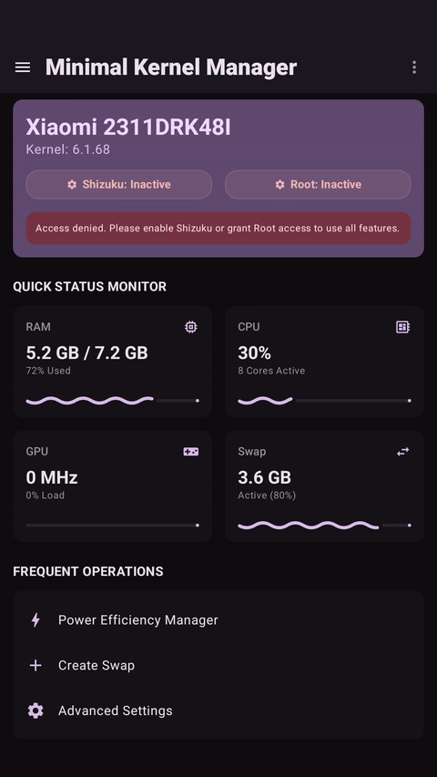</a>
</td>
</tr>
<tr>
<td width="50%" valign="top" style="padding:18px 12px;border-bottom:1px solid #3c3836;">
<h3> <a href="https://github.com/abhay-byte/Saiko-no-senshi-0.1v"><b>Story of Xirsia</b></a></h3>
2D Role Playing Game set in Medieval age with a massive 25km² open world of Xirsia Isle to explore.  
  
</td>
<td width="50%" align="center" valign="middle" style="padding:18px 12px;border-bottom:1px solid #3c3836;">

</td>
</tr>
<tr>
<td width="50%" valign="top" style="padding:18px 12px;border-bottom:1px solid #3c3836;">
<h3> <a href="https://github.com/abhay-byte/planet-racing"><b>Fantasy Racing</b></a></h3>
High-speed futuristic racing game with diverse planets, strategic challenges, and immersive gameplay.  
 
</td>
<td width="50%" align="center" valign="middle" style="padding:18px 12px;border-bottom:1px solid #3c3836;">

</td>
</tr>
<tr>
<td width="50%" valign="top" style="padding:18px 12px;border-bottom:1px solid #3c3836;">
<h3>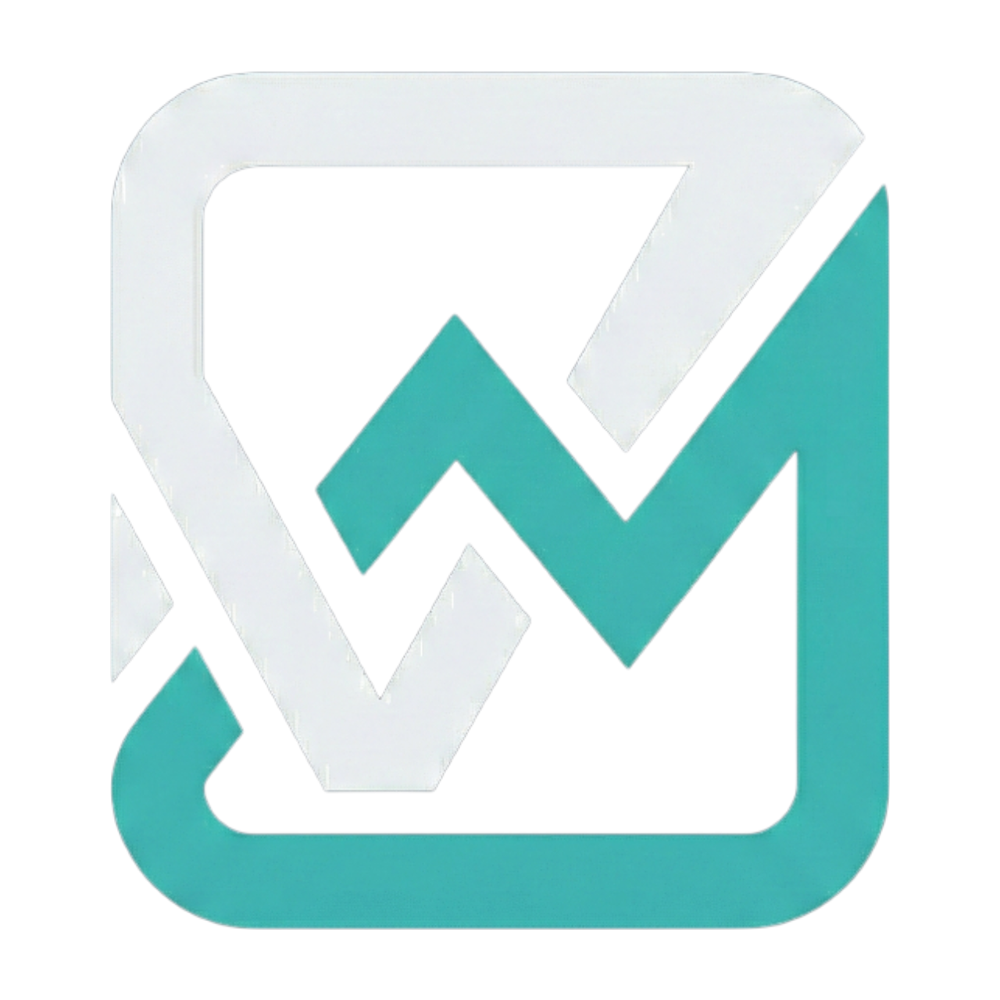 <a href="https://github.com/abhay-byte/phone_finder_hub"><b>Phone Finder Hub</b></a></h3>
Data-driven smartphone comparison platform built with Laravel. Identify best value-for-money devices via objective performance benchmarks vs current market prices.  
 
</td>
<td width="50%" align="center" valign="middle" style="padding:18px 12px;border-bottom:1px solid #3c3836;">
<a href="https://github.com/abhay-byte/phone_finder_hub">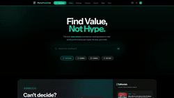</a>
</td>
</tr>
<tr>
<td width="50%" valign="top" style="padding:18px 12px;border-bottom:1px solid #3c3836;">
<h3> <a href="https://github.com/abhay-byte/deviceinsight"><b>DeviceInsight</b></a></h3>
Premium system monitoring with glassmorphism UI and real-time analytics.  
  
</td>
<td width="50%" align="center" valign="middle" style="padding:18px 12px;border-bottom:1px solid #3c3836;">

</td>
</tr>
<tr>
<td width="50%" valign="top" style="padding:18px 12px;border-bottom:1px solid #3c3836;">
<h3>👻 <a href="https://github.com/abhay-byte/valentines-day-unity"><b>Whispers in the Mist</b></a></h3>
Horror game set in St. Xavier's Boarding School in Ooty during Valentine's Day with mysterious occurrences.  
 
</td>
<td width="50%" align="center" valign="middle" style="padding:18px 12px;border-bottom:1px solid #3c3836;">

</td>
</tr>
<tr>
<td width="50%" valign="top" style="padding:18px 12px;border-bottom:1px solid #3c3836;">
<h3> <a href="https://github.com/abhay-byte/minor-project-gtbit"><b>Clinico</b></a></h3>
AI-powered healthcare platform with 24/7 AI companion, telehealth, and hyperlocal clinic discovery.  
     
</td>
<td width="50%" align="center" valign="middle" style="padding:18px 12px;border-bottom:1px solid #3c3836;">

</td>
</tr>
<tr>
<td width="50%" valign="top" style="padding:18px 12px;border-bottom:1px solid #3c3836;">
<h3> <a href="https://github.com/abhay-byte/my-portfolio"><b>My Portfolio</b></a></h3>
Personal portfolio website showcasing projects, skills, and experience with responsive design.  
  
</td>
<td width="50%" align="center" valign="middle" style="padding:18px 12px;border-bottom:1px solid #3c3836;">
<a href="https://github.com/abhay-byte/my-portfolio">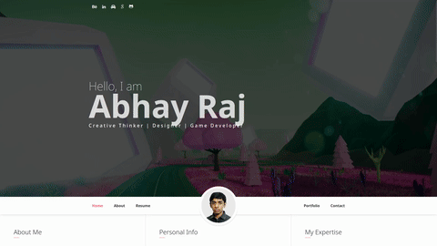</a>
</td>
</tr>
<tr>
<td width="50%" valign="top" style="padding:18px 12px;border-bottom:1px solid #3c3836;">
<h3> <a href="https://github.com/abhay-byte/webgl-website"><b>WebGL Website</b></a></h3>
Interactive website built with WebGL for stunning 3D graphics and animations.  
  
</td>
<td width="50%" align="center" valign="middle" style="padding:18px 12px;border-bottom:1px solid #3c3836;">

</td>
</tr>
<tr>
<td width="50%" valign="top" style="padding:18px 12px;border-bottom:1px solid #3c3836;">
<h3> <a href="https://github.com/abhay-byte/nativecode"><b>NativeCode</b></a></h3>
Local AI development environment on Android — run LLMs, code editors, and dev tools on-device.  
 
</td>
<td width="50%" align="center" valign="middle" style="padding:18px 12px;border-bottom:1px solid #3c3836;">
<a href="https://github.com/abhay-byte/nativecode">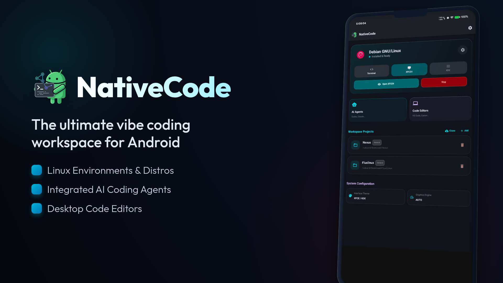</a>
</td>
</tr>
<tr>
<td width="50%" valign="top" style="padding:18px 12px;border-bottom:1px solid #3c3836;">
<h3>📊 <a href="https://github.com/abhay-byte/AI_WRAPPER_PROJECTS"><b>Investment Growth Prediction</b></a></h3>
AI-powered investment growth predictor with monthly contribution simulations, CSV reports, and graphical insights.  
  
</td>
<td width="50%" align="center" valign="middle" style="padding:18px 12px;border-bottom:1px solid #3c3836;">

</td>
</tr>
<tr>
<td width="50%" valign="top" style="padding:18px 12px;border-bottom:1px solid #3c3836;">
<h3>✨ <a href="https://github.com/abhay-byte/threejs_portfolio"><b>ThreeJS Portfolio</b></a></h3>
Interactive 3D portfolio website built with Three.js.  
 
</td>
<td width="50%" align="center" valign="middle" style="padding:18px 12px;border-bottom:1px solid #3c3836;">

</td>
</tr>
<tr>
<td width="50%" valign="top" style="padding:18px 12px;border-bottom:1px solid #3c3836;">
<h3> <a href="https://github.com/abhay-byte/truvalt"><b>Truvalt</b></a></h3>
Secure, self-hostable, zero-knowledge password manager for Android and web.  
 
</td>
<td width="50%" align="center" valign="middle" style="padding:18px 12px;border-bottom:1px solid #3c3836;">

</td>
</tr>
<tr>
<td width="50%" valign="top" style="padding:18px 12px;border-bottom:1px solid #3c3836;">
<h3>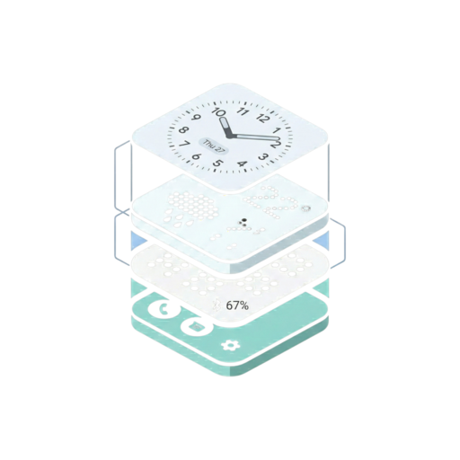 <a href="https://github.com/abhay-byte/allwidgets"><b>AllWidgets</b></a></h3>
Widget suite with polished home-screen experiences for multiple device skins.  
 
</td>
<td width="50%" align="center" valign="middle" style="padding:18px 12px;border-bottom:1px solid #3c3836;">
<a href="https://github.com/abhay-byte/allwidgets">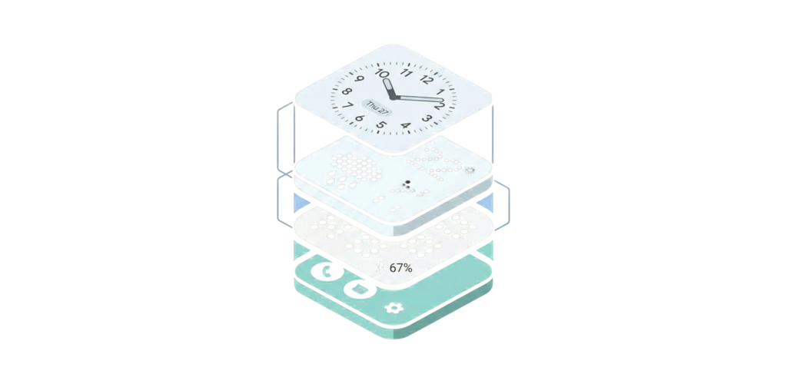</a>
</td>
</tr>
<tr>
<td width="50%" valign="top" style="padding:18px 12px;border-bottom:1px solid #3c3836;">
<h3> <a href="https://github.com/abhay-byte/TaskStack"><b>TaskStack</b></a></h3>
Next-generation daily task management app with a 24-hour visual timeline and life analytics.  
 
</td>
<td width="50%" align="center" valign="middle" style="padding:18px 12px;border-bottom:1px solid #3c3836;">

</td>
</tr>
<tr>
<td width="50%" valign="top" style="padding:18px 12px;border-bottom:1px solid #3c3836;">
<h3> <a href="https://github.com/abhay-byte/warden-protocol"><b>Warden Protocol</b></a></h3>
Single-player Android strategy game where you act as bunker intelligence for survivors.  
  
</td>
<td width="50%" align="center" valign="middle" style="padding:18px 12px;border-bottom:1px solid #3c3836;">

</td>
</tr>
<tr>
<td width="50%" valign="top" style="padding:18px 12px;border-bottom:1px solid #3c3836;">
<h3>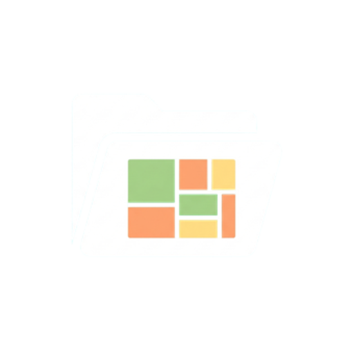 <a href="https://github.com/abhay-byte/Adirstat"><b>Adirstat</b></a></h3>
Android Disk Space Analyzer (WizTree/WinDirStat equivalent).  
  
</td>
<td width="50%" align="center" valign="middle" style="padding:18px 12px;border-bottom:1px solid #3c3836;">
<a href="https://github.com/abhay-byte/Adirstat">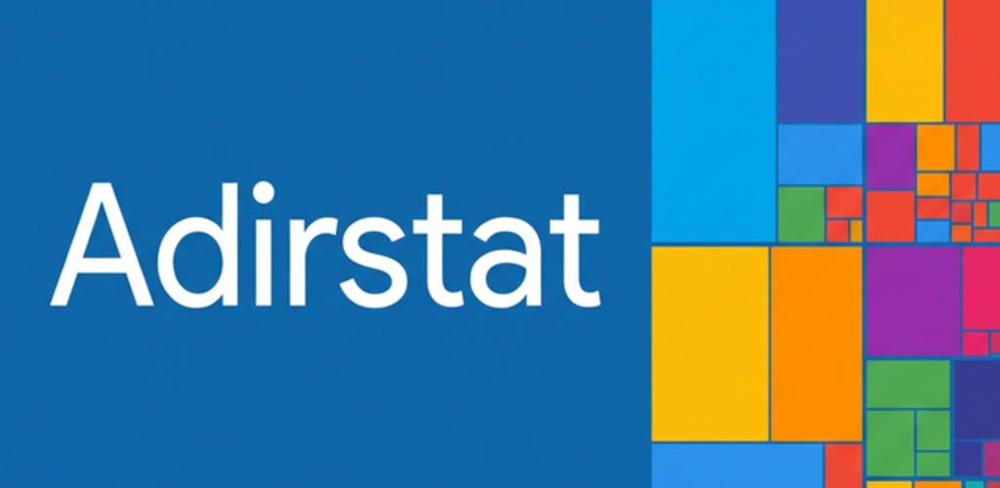</a>
</td>
</tr>
<tr>
<td width="50%" valign="top" style="padding:18px 12px;border-bottom:1px solid #3c3836;">
<h3>📦 <a href="https://github.com/abhay-byte/apm"><b>APM</b></a></h3>
Android package manager — install, batch-install, and manage APKs on Android devices via ADB.  
 
</td>
<td width="50%" align="center" valign="middle" style="padding:18px 12px;border-bottom:1px solid #3c3836;">
<a href="https://github.com/abhay-byte/apm">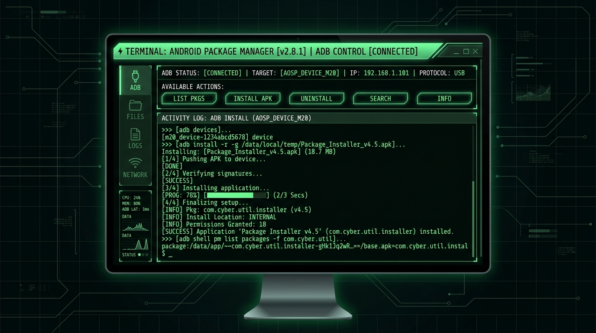</a>
</td>
</tr>
<tr>
<td width="50%" valign="top" style="padding:18px 12px;border-bottom:1px solid #3c3836;">
<h3>🐧 <a href="https://github.com/abhay-byte/Linux_Setup"><b>Linux_Setup</b></a></h3>
Automated Arch Linux/Hyprland/XFCE setup scripts for Termux proot-distro on Android.  
 
</td>
<td width="50%" align="center" valign="middle" style="padding:18px 12px;border-bottom:1px solid #3c3836;">
<a href="https://github.com/abhay-byte/Linux_Setup">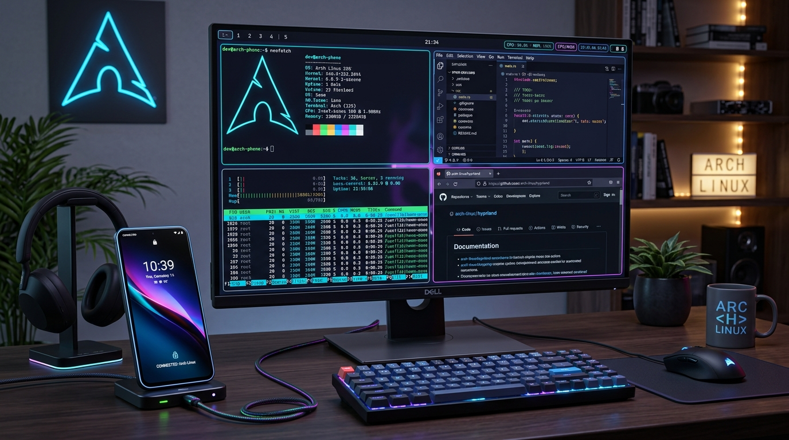</a>
</td>
</tr>
<tr>
<td width="50%" valign="top" style="padding:18px 12px;border-bottom:1px solid #3c3836;">
<h3>🎮 <a href="https://github.com/abhay-byte/mali-win-emu-list"><b>Mali Win Emu List</b></a></h3>
Community-driven compatibility list for running Windows games on Android via Mali GPUs.  
  
</td>
<td width="50%" align="center" valign="middle" style="padding:18px 12px;border-bottom:1px solid #3c3836;">

</td>
</tr>
<tr>
<td width="50%" valign="top" style="padding:18px 12px;border-bottom:1px solid #3c3836;">
<h3>🌎 <a href="https://github.com/abhay-byte/AI_Survival_Quest-V1.0"><b>AI Survival Quest</b></a></h3>
AI-driven text-based survival game — a Seedship-inspired remake with randomized outcomes.  
 
</td>
<td width="50%" align="center" valign="middle" style="padding:18px 12px;border-bottom:1px solid #3c3836;">
<a href="https://github.com/abhay-byte/AI_Survival_Quest-V1.0">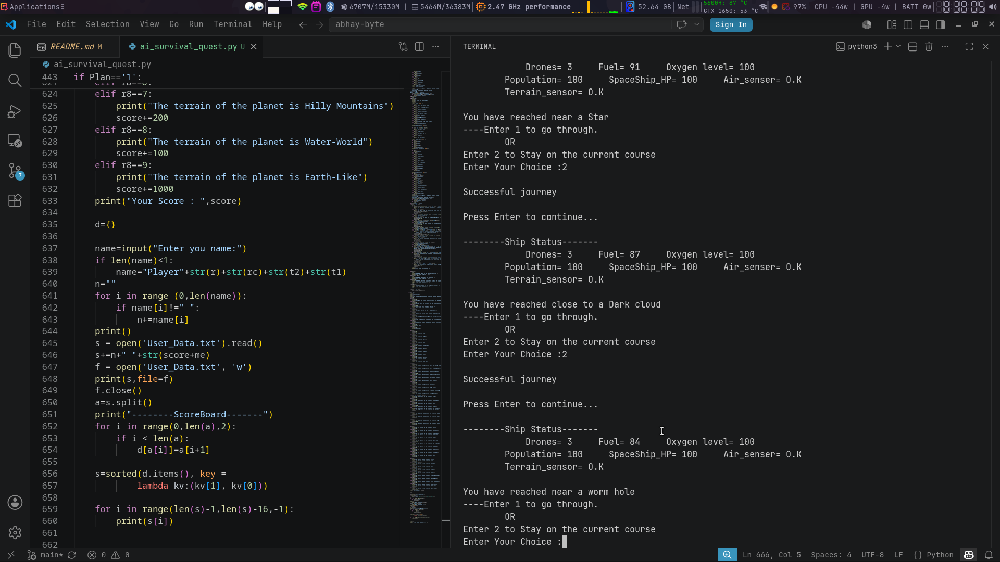</a>
</td>
</tr>
<tr>
<td width="50%" valign="top" style="padding:18px 12px;border-bottom:1px solid #3c3836;">
<h3>🌿 <a href="https://github.com/abhay-byte/project-evergreen"><b>Project Evergreen</b></a></h3>
Retail platform combining e-commerce marketplace, sustainability tracking, and operational efficiency.  
 
</td>
<td width="50%" align="center" valign="middle" style="padding:18px 12px;border-bottom:1px solid #3c3836;">
<a href="https://github.com/abhay-byte/project-evergreen">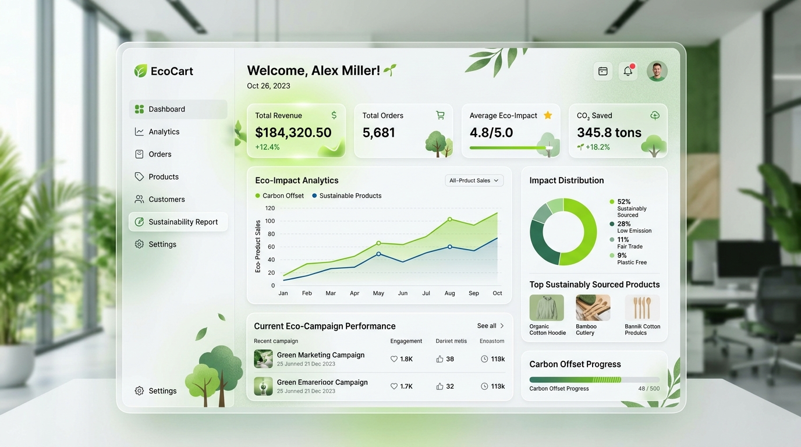</a>
</td>
</tr>
<tr>
<td width="50%" valign="top" style="padding:18px 12px;">
<h3>🏥 <a href="https://github.com/abhay-byte/MedApp-V2.1"><b>MedApp-V2.1</b></a></h3>
Disease prediction app using symptom analysis with a built-in medical knowledge base.  
 
</td>
<td width="50%" align="center" valign="middle" style="padding:18px 12px;">

</td>
</tr>
</tbody>
</table>

## 🏆 GitHub Stats

